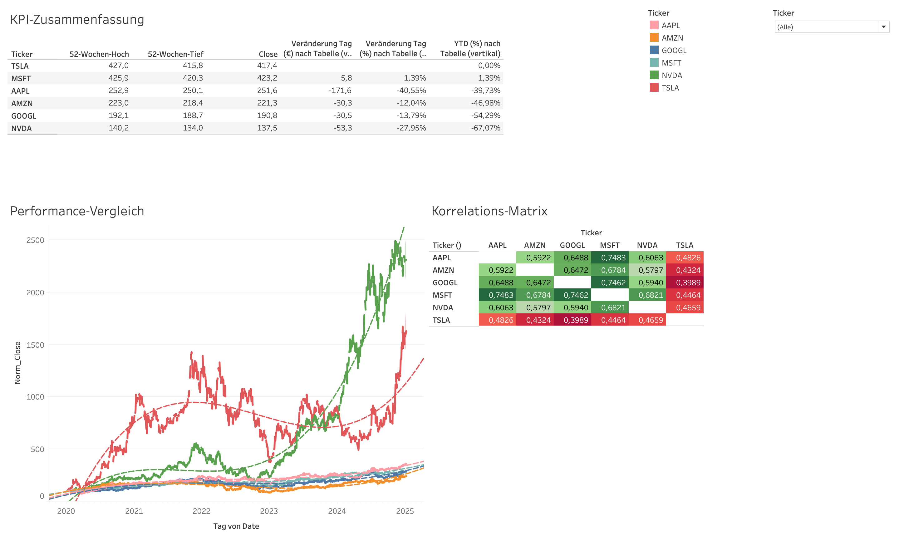

# -Stock-Analysis-Dashboard-Python-and-Tableau
This project was created as an assignment for my course on data preparation and processing at THWS. It is an interactive stock analysis dashboard, built with Python and later visualized using Tableau.

## Overview

This project consists of two main components:
1.  **A Python script (as a Jupyter Notebook)** that retrieves historical stock price data, calculates over 30 technical indicators (such as RSI, MACD, and Bollinger Bands), and saves the processed data as CSV files.
2.  **A Tableau dashboard**, which uses these CSV files as a data source to enable complex visualizations and analyses.

## Dashboard Features
- **KPI Summary:** Key metrics such as 52-week high/low at a glance.
- **Performance Comparison:** Normalized price development for easy comparison of stocks.
- **Correlation Matrix:** Shows how stock prices move relative to each other.
- **Detailed Analysis:** Deep insights into price, volume, RSI, and MACD for individual stocks.
- **Volatility and Signal Analysis:** Compares volatility and the frequency of buy/sell signals.

## How to Use
1.  **Generate Data:** Open `DAV_Präsentation.ipynb` in a Jupyter environment and run `Aktien_Dashboard.py` to create the `aktien_dashboard_enhanced.csv` and `ticker_info_dynamic.csv` files.
2.  **Open Dashboard:** Open the `Aktien Dashboard.twb` file with Tableau Desktop or Tableau Reader. The data is packaged within the workbook.

## Technologies Used
- **Data Acquisition:** Python, Pandas, numpy, yfinance
- **Visualization:** Tableau
- **Version Control:** Git, GitHub
